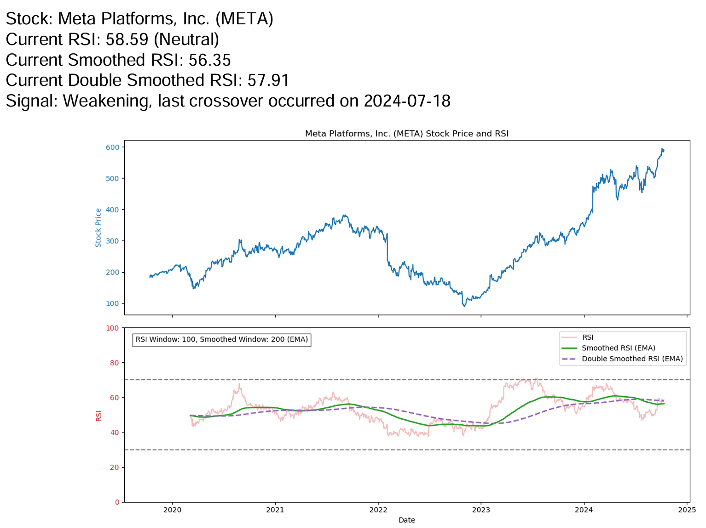

# Stock Checker RSI

## Description

Stock Checker RSI is a Python-based tool that calculates and analyzes the Relative Strength Index (RSI) for given stocks. It leverages financial data from Yahoo Finance to compute RSI values and provides comprehensive analysis through various outputs.

The script performs the following key functions:
1. Fetches historical stock data for specified symbols using the yfinance library.
2. Calculates the RSI for each stock, along with smoothed and double-smoothed RSI values.
3. Generates line plots of the stock price, RSI, smoothed RSI, and double-smoothed RSI over time.
4. Creates a PDF report containing detailed analysis and plots for each stock.
5. Sends email alerts with the PDF report attached when recent crossovers are detected.

Key features include:
- Analysis of multiple stocks in a single run
- Customizable RSI and smoothing windows
- PDF report generation with stock analysis and visualizations
- Email alerts for stocks showing significant changes (recent crossovers)
- Sorting of results based on current RSI values (highest to lowest)

This tool is designed to assist traders and investors in technical analysis by providing RSI calculations and identifying potential trend changes through crossover detection.

## Configuration

The tool can be configured through environment variables for email settings:
- SMTP_SERVER: SMTP server for sending emails
- SMTP_PORT: Port for the SMTP server
- SMTP_USERNAME: Username for SMTP authentication
- SMTP_PASSWORD: Password for SMTP authentication
- SENDER_EMAIL: Email address to send alerts from
- RECIPIENT_EMAIL: Email address to receive alerts

## Output

The script generates:
- Console output with a summary of each stock's analysis, sorted by current RSI value from highest to lowest
- A PDF report ("stock_analysis.pdf") containing detailed analysis and plots for each stock, also sorted by RSI
- Email alerts (if configured) when recent crossovers are detected, with the PDF report attached

The sorting of results by RSI value is particularly relevant as it allows users to quickly identify which stocks are potentially overbought (high RSI) or oversold (low RSI) relative to the others in the analyzed set. This can be useful for prioritizing which stocks to focus on for potential trading opportunities.

## Sample Output

Below is a sample output of the RSI analysis for a stock:



## Features

- Fetch stock data using yfinance
- Calculate RSI, smoothed RSI, and double-smoothed RSI for specified stocks
- Generate line plots of stock price and RSI values over time
- Create PDF reports with detailed analysis and visualizations for each stock
- Sort and analyze multiple stocks in a single run
- Detect recent crossovers between smoothed and double-smoothed RSI
- Send email alerts with attached PDF reports when significant changes are detected
- Customizable RSI and smoothing windows
- Configurable email settings for alerts

## Installation

1. Clone this repository:
   ```
   git clone https://github.com/yourusername/stock-checker-rsi.git
   cd stock-checker-rsi
   ```

2. Install required dependencies:
   ```
   pip install -r requirements.txt
   ```

## Usage

To use the Stock Checker RSI tool, modify the `symbols` list in the `stock_checker_rsi.py` file:

python
symbols = ['AAPL', 'GOOGL', 'MSFT'] # Add or remove stock symbols as needed

Then run the script:

python stock_checker_rsi.py

## Future Improvements

1. Add additional indicators and calculations for determining overbought / oversold status

## License

This project is licensed under the GNU General Public License v3.0.

The GNU GPL is a copyleft license that requires anyone who distributes this code or a derivative work to make the source available under the same terms. It is designed to ensure that all modified and extended versions of the project are free software.

For more details about this license, please visit: https://www.gnu.org/licenses/gpl-3.0.en.html
